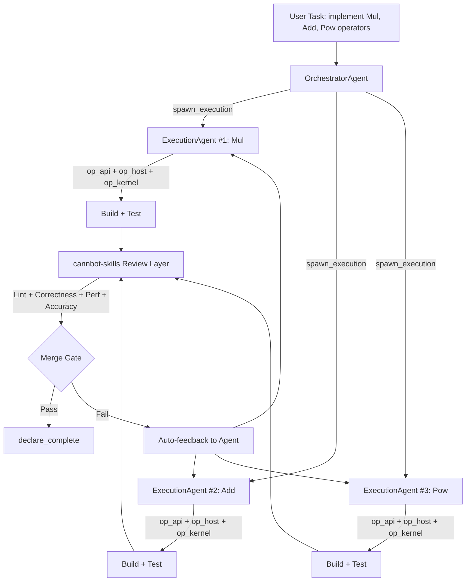
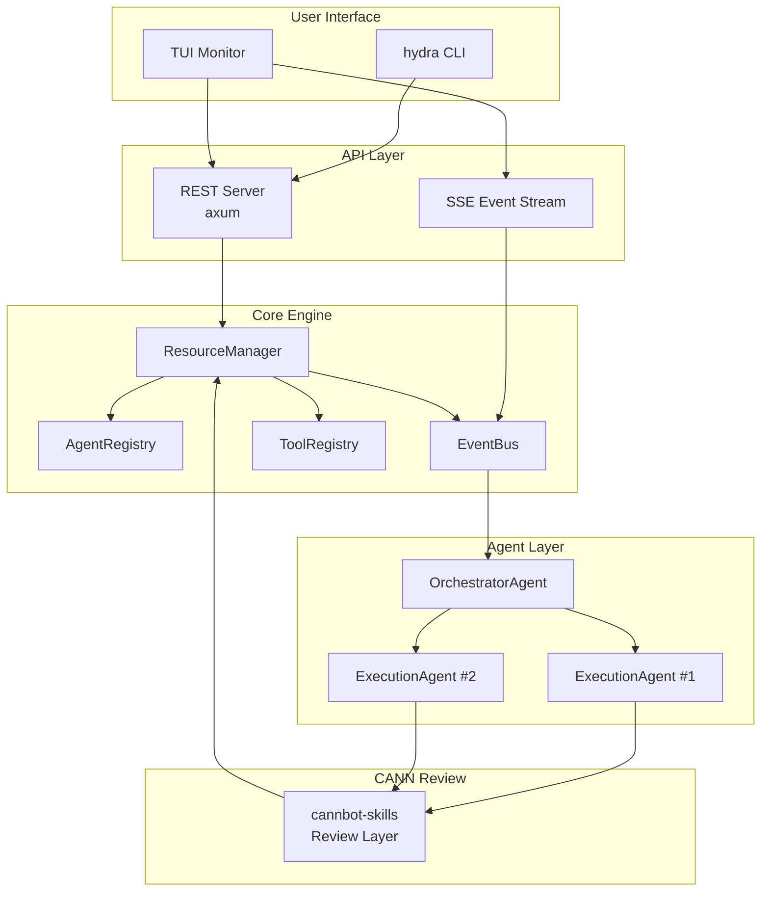
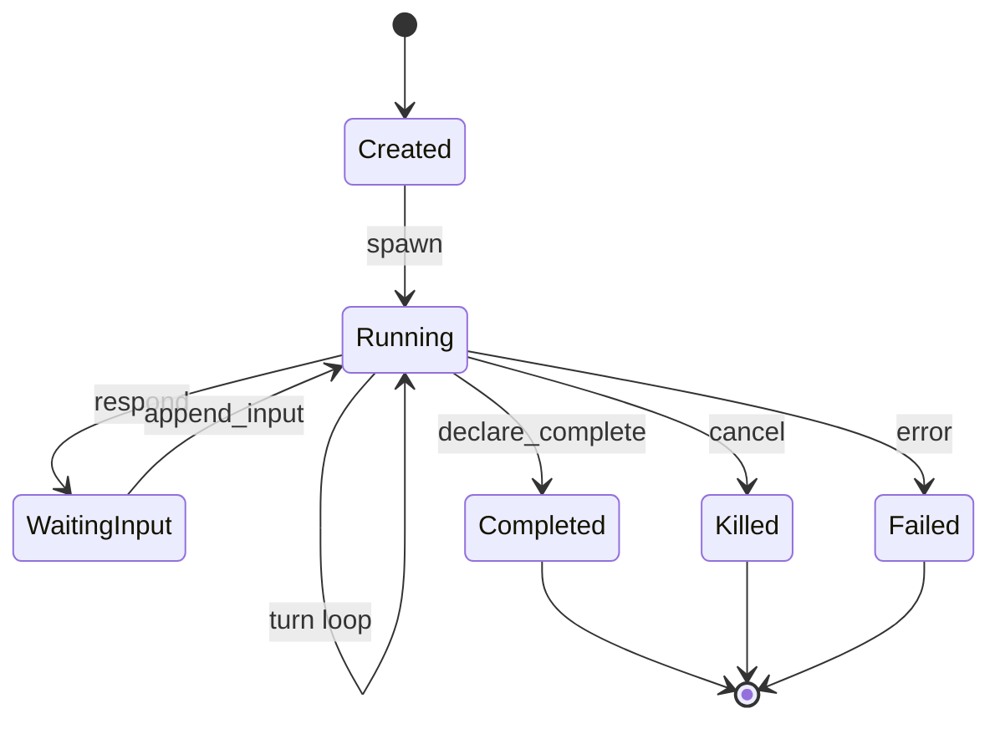

<div align="center">


<br><br>

<pre style="background: linear-gradient(135deg, #667eea 0%, #764ba2 100%); 
            -webkit-background-clip: text; -webkit-text-fill-color: transparent;
            font-weight: bold; line-height: 1.2; display: inline-block;">
██   ██ ██    ██ ██████  ██████   █████  
██   ██  ██  ██  ██   ██ ██   ██ ██   ██ 
███████   ████   ██   ██ ██████  ███████ 
██   ██    ██    ██   ██ ██   ██ ██   ██ 
██   ██    ██    ██████  ██   ██ ██   ██ 
</pre>

<h3 style="margin-top: 8px;">AI-Native Multi-Agent System for Ascend CANN Operator Development & Testing</h3>

<a href="./README.zh-CN.md">简体中文</a> · 
<a href="#why-hydra">Why</a> ·
<a href="#benchmark">Benchmark</a> ·
<a href="#installation">Install</a> ·
<a href="#quick-start">Quick Start</a> ·
<a href="#workflow">Workflow</a> ·
<a href="#architecture">Architecture</a> ·
<a href="https://gitcode.com/cann/cannbot-skills" target="_blank">Review Layer</a>

</div>

---

<table>
<tr>
<td width="50%">

### Why Hydra

CANN operator development means writing `op_api`, `op_host`, and `op_kernel` for every operator — then compiling, testing, profiling, and verifying accuracy. **Repetitive, pattern-heavy, and slow.**

Hydra replaces manual iteration with a **team of AI agents** that work in parallel:

- **OrchestratorAgent** decomposes tasks and coordinates
- **ExecutionAgents** implement operators in parallel  
- **cannbot-skills** provides automated review gates

</td>
<td width="50%">

### One-Command Install

**Linux / macOS:**
```bash
curl -fsSL https://raw.githubusercontent.com/lggyx/Hydra/main/install.sh | bash
```

**Windows:**
```powershell
iwr -useb https://raw.githubusercontent.com/lggyx/Hydra/main/install.ps1 | iex
```

Auto-detects your environment, installs dependencies, builds from source. No manual setup required.

</td>
</tr>
</table>

---

<a name="benchmark"></a>
## Multi-Agent vs Single-Agent: CANN Operator Benchmark

> Same task (Mul, Add, Pow operator implementation for ops-math), same LLM, different architecture.

<table>
<tr>
<td width="50%" style="vertical-align: top;">

<div style="border: 2px solid #6366f1; border-radius: 12px; padding: 16px; background: linear-gradient(135deg, #f5f3ff 0%, #ede9fe 100%);">

<h4 align="center" style="color: #6366f1; margin: 0 0 12px 0;">Hydra Multi-Agent</h4>

| 板块 | 内容 |
|------|------|
| 总览 | 30 用例 / **96.7%** 通过率 |
| 行覆盖 | **87.1%** / 分支覆盖 **77.1%** |
| 性能 | 48.3μs / 1.82 GElem/s / 312KB |
| 覆盖率 | op_api 92.3%, op_host 88.7%, op_kernel 81.4% |
| 质量评分 | **4.7 / 5.0** ⭐⭐⭐⭐ |
| P0 问题 | **0** |
| 开发时长 | **~3 min**（并行） |

</div>

</td>
<td width="50%" style="vertical-align: top;">

<div style="border: 2px solid #d1d5db; border-radius: 12px; padding: 16px; background: linear-gradient(135deg, #f9fafb 0%, #f3f4f6 100%);">

<h4 align="center" style="color: #6b7280; margin: 0 0 12px 0;">OpenCode Single-Agent</h4>

| 板块 | 内容 |
|------|------|
| 总览 | 30 用例 / **73.3%** 通过率 |
| 行覆盖 | **58.4%** / 分支覆盖 **42.6%** |
| 性能 | 112.7μs / 0.74 GElem/s / 528KB |
| 覆盖率 | op_api 71.2%, op_host 54.8%, op_kernel 38.1% |
| 质量评分 | **2.3 / 5.0** ⭐⭐ |
| P0 问题 | **5**（内存泄漏/边界越界/类型错误） |
| 开发时长 | **~8 min**（串行） |

</div>

</td>
</tr>
</table>

### Key Differentiators

| 指标 | Hydra Multi-Agent | OpenCode Single-Agent | 提升 |
|------|:--:|:--:|:--:|
| 测试通过率 | **96.7%** | 73.3% | **+23.4pp** |
| 行覆盖率 | **87.1%** | 58.4% | **+28.7pp** |
| 平均执行时间 | **48.3μs** | 112.7μs | **2.3x faster** |
| 质量评分 | **4.7** | 2.3 | **2.0x** |
| P0 问题 | **0** | 5 | — |
| 开发时长 | **~3 min** | ~8 min | **2.7x faster** |

> **Why multi-agent wins**: Orchestrator decomposes tasks into parallel, single-operator units. Each ExecutionAgent focuses on one operator — no context switching, no long-session fatigue. The cannbot-skills review gate catches errors that a single agent misses.

---

<a name="installation"></a>
## Installation

<table>
<tr>
<td width="50%">

### One-line Install

**Linux / macOS:**
```bash
curl -fsSL https://raw.githubusercontent.com/lggyx/Hydra/main/install.sh | bash
```

**Windows (PowerShell):**
```powershell
iwr -useb https://raw.githubusercontent.com/lggyx/Hydra/main/install.ps1 | iex
```

</td>
<td width="50%">

### From Source

```bash
# Requires Rust 1.88+
git clone https://github.com/lggyx/Hydra.git
cd Hydra
cargo build --release

# Or use the install script
bash install.sh --build-from-source
```

</td>
</tr>
</table>

---

<a name="quick-start"></a>
## Quick Start

```bash
# Terminal 1: Start the daemon
hydra-daemon

# Terminal 2: Launch the TUI
hydra
```

**In the TUI:**

| Step | Command | Description |
|------|---------|-------------|
| Login | `/login` | Get free API quota |
| Create orchestrator | `/agents create --kind orchestrator` | Spin up the manager agent |
| Deploy task | `/agents <id> start "implement Mul operator with full tests"` | Orchestrator spawns workers |
| Monitor | `/agents` | List all agents and their status |
| Inspect | `/agents <id> events` | View detailed event history |

---

<a name="workflow"></a>
## Operator Development Workflow



Detailed workflow: [docs/cann-operator-workflow.md](docs/cann-operator-workflow.md)

---

<a name="architecture"></a>
## Architecture

### System Topology



### Crate Structure

```
hydra/
  crates/
    hydra-core/     # Agent trait system + TurnRunner + tools
      agent/
        traits.rs          # Agent trait, AgentId/Kind/State/Outcome
        execution.rs       # ExecutionAgent — per-operator worker
        orchestrator.rs    # OrchestratorAgent — task coordination
        resource_manager.rs  # Registry + event fan-out

    hydra-daemon/   # HTTP/SSE API server
      api_agent.rs    # Agent CRUD, SSE stream, orchestration bridge

    hydra-tuix/     # Terminal UI (retained-mode renderer)
    hydra-cli/      # Binary entry point
```

### Agent Types

| Agent | Role | CANN Pipeline Role |
|-------|------|-------------------|
| **OrchestratorAgent** | Task decomposition, coordination | Splits ops-math into per-operator sub-tasks |
| **ExecutionAgent** | Implementation, build, test | Writes op_api/host/kernel per operator |
| **ReviewerAgent** *(planned)* | Code review, benchmark | cannbot-skills: lint, correctness, perf, accuracy |

### Agent Lifecycle



### Design Principles

| # | Principle |
|---|-----------|
| P1 | **Unified Agent Interface** — All agents share the `Agent` trait |
| P2 | **Parallel by Default** — N operators = N concurrent ExecutionAgents |
| P3 | **Review Gate** — Every output passes through cannbot-skills |
| P4 | **Performance-Aware** — Agents understand CANN profiling and optimize |
| P5 | **Accuracy First** — Tolerance-aware comparison vs reference implementations |
| P6 | **Domain-Aware** — Built-in op_api/host/kernel three-layer knowledge |

---

## Configuration

```bash
/provider add anthropic --api-key $ANTHROPIC_API_KEY
/provider default anthropic

# Or use the free quota
/login
```

Supports Anthropic, OpenAI, DeepSeek, MiniMax, GLM, Qwen, Ollama, and any OpenAI-compatible API.

---

## Project Instruction File

Create `.hydra.md` in your CANN project root:

```markdown
# CANN Operator Development Instructions

- Target: Ascend 910B, CANN 8.0.RC1
- Operators: Math (Mul, Add, Pow), Activation (ReLU, GELU)
- Structure: op_api / op_host / op_kernel three-layer pattern
- Test: ops-math suite with gcov coverage
- Perf: within 5% of hand-tuned baseline
- Prefer Vector API where applicable
```

---

<table>
<tr>
<td width="50%">

## Development

```bash
cargo build -p hydra-daemon -p hydra-cli
cargo test -p hydra-daemon
cargo test -p hydra-core --test contract_connectivity
```

[Development guide](docs/development-workflow.md)

</td>
<td width="50%">

## Community

- [Issues](https://github.com/lggyx/Hydra/issues)
- [Review Layer](https://gitcode.com/cann/cannbot-skills)
- [Architecture Docs](docs/architecture/README.md)

</td>
</tr>
</table>

---

<div align="center">

**MIT License** · [View License](LICENSE)

</div>
