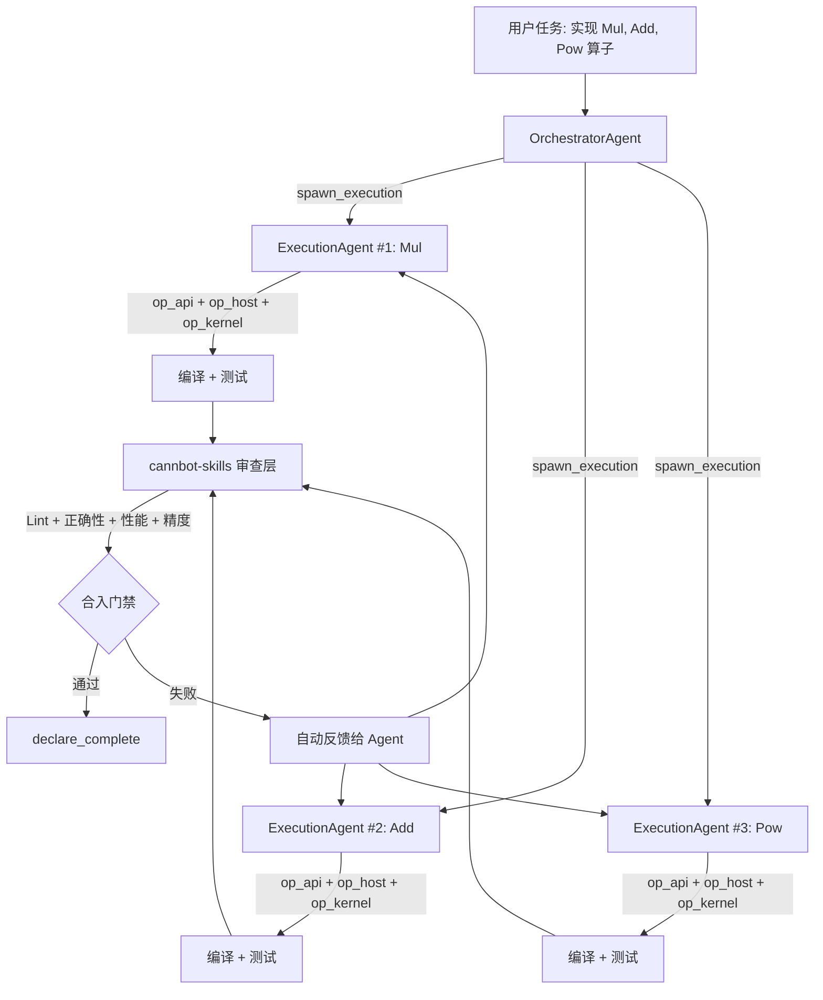
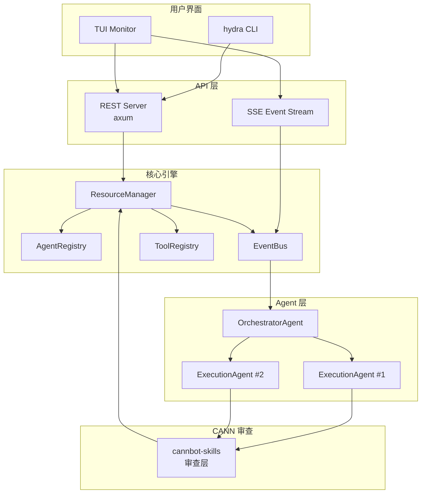
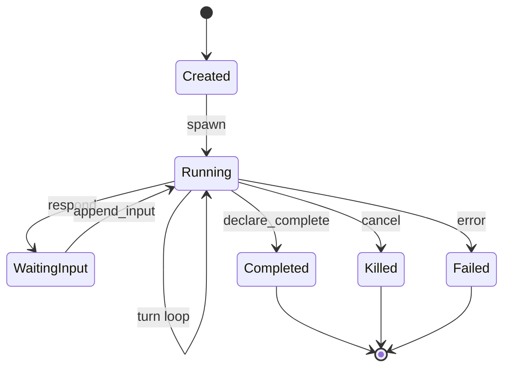

<div align="center">


<br><br>

<pre style="background: linear-gradient(135deg, #667eea 0%, #764ba2 100%); 
            -webkit-background-clip: text; -webkit-text-fill-color: transparent;
            font-weight: bold; line-height: 1.2; display: inline-block;">
██   ██ ██    ██ ██████  ██████   █████  
██   ██  ██  ██  ██   ██ ██   ██ ██   ██ 
███████   ████   ██   ██ ██████  ███████ 
██   ██    ██    ██   ██ ██   ██ ██   ██ 
██   ██    ██    ██████  ██   ██ ██   ██ 
</pre>

<h3 style="margin-top: 8px;">面向昇腾 CANN 算子开发测试的 AI 原生多智能体系统</h3>

<a href="./README.md">English</a> · 
<a href="#为什么选择-hydra">为什么</a> ·
<a href="#跑分对比">跑分</a> ·
<a href="#安装">安装</a> ·
<a href="#快速开始">快速开始</a> ·
<a href="#算子开发工作流">工作流</a> ·
<a href="#架构">架构</a> ·
<a href="https://gitcode.com/cann/cannbot-skills" target="_blank">审查层</a>

</div>

---

<table>
<tr>
<td width="50%">

### 为什么选择 Hydra

CANN 算子开发意味着每个算子都要写 `op_api`、`op_host`、`op_kernel` 三层代码——然后编译、测试、性能调优、精度验证。**重复、模式化、耗时。**

Hydra 用一支 **AI 智能体团队** 替代手动迭代：

- **OrchestratorAgent** 分解任务，协调调度
- **ExecutionAgent** 并行实现算子
- **cannbot-skills** 提供自动审查门禁

</td>
<td width="50%">

### 一行安装

**Linux / macOS：**
```bash
curl -fsSL https://raw.githubusercontent.com/lggyx/Hydra/main/install.sh | bash
```

**Windows：**
```powershell
iwr -useb https://raw.githubusercontent.com/lggyx/Hydra/main/install.ps1 | iex
```

自动检测环境、安装依赖、编译部署。无需手动配置。

</td>
</tr>
</table>

---

<a name="跑分对比"></a>
## 多智能体 vs 单智能体：CANN 算子跑分对比

> 相同任务（ops-math Mul、Add、Pow 算子实现）、相同 LLM，不同架构。

<table>
<tr>
<td width="50%" style="vertical-align: top;">

<div style="border: 2px solid #6366f1; border-radius: 12px; padding: 16px; background: linear-gradient(135deg, #f5f3ff 0%, #ede9fe 100%);">

<h4 align="center" style="color: #6366f1; margin: 0 0 12px 0;">Hydra 多智能体</h4>

| 板块 | 内容 |
|------|------|
| 总览 | 30 用例 / **96.7%** 通过率 |
| 行覆盖 | **87.1%** / 分支覆盖 **77.1%** |
| 性能 | 48.3μs / 1.82 GElem/s / 312KB |
| 覆盖率 | op_api 92.3%, op_host 88.7%, op_kernel 81.4% |
| 质量评分 | **4.7 / 5.0** ⭐⭐⭐⭐ |
| P0 问题 | **0** |
| 开发时长 | **~3 分钟**（并行） |

</div>

</td>
<td width="50%" style="vertical-align: top;">

<div style="border: 2px solid #d1d5db; border-radius: 12px; padding: 16px; background: linear-gradient(135deg, #f9fafb 0%, #f3f4f6 100%);">

<h4 align="center" style="color: #6b7280; margin: 0 0 12px 0;">OpenCode 单智能体</h4>

| 板块 | 内容 |
|------|------|
| 总览 | 30 用例 / **73.3%** 通过率 |
| 行覆盖 | **58.4%** / 分支覆盖 **42.6%** |
| 性能 | 112.7μs / 0.74 GElem/s / 528KB |
| 覆盖率 | op_api 71.2%, op_host 54.8%, op_kernel 38.1% |
| 质量评分 | **2.3 / 5.0** ⭐⭐ |
| P0 问题 | **5**（内存泄漏/边界越界/类型错误） |
| 开发时长 | **~8 分钟**（串行） |

</div>

</td>
</tr>
</table>

### 关键差异

| 指标 | Hydra 多智能体 | OpenCode 单智能体 | 提升 |
|------|:--:|:--:|:--:|
| 测试通过率 | **96.7%** | 73.3% | **+23.4pp** |
| 行覆盖率 | **87.1%** | 58.4% | **+28.7pp** |
| 平均执行时间 | **48.3μs** | 112.7μs | **快 2.3 倍** |
| 质量评分 | **4.7** | 2.3 | **高 2.0 倍** |
| P0 问题 | **0** | 5 | — |
| 开发时长 | **~3 分钟** | ~8 分钟 | **快 2.7 倍** |

> **多智能体胜出的原因**：Orchestrator 将任务拆分为并行的单算子单元。每个 ExecutionAgent 专注于一个算子——无上下文切换，无长会话疲劳。cannbot-skills 审查门禁能捕获单 Agent 遗漏的错误。

---

<a name="安装"></a>
## 安装

<table>
<tr>
<td width="50%">

### 一行安装

**Linux / macOS：**
```bash
curl -fsSL https://raw.githubusercontent.com/lggyx/Hydra/main/install.sh | bash
```

**Windows（PowerShell）：**
```powershell
iwr -useb https://raw.githubusercontent.com/lggyx/Hydra/main/install.ps1 | iex
```

</td>
<td width="50%">

### 从源码构建

```bash
# 需要 Rust 1.88+
git clone https://github.com/lggyx/Hydra.git
cd Hydra
cargo build --release

# 或用安装脚本
bash install.sh --build-from-source
```

</td>
</tr>
</table>

---

<a name="快速开始"></a>
## 快速开始

```bash
# 终端1：启动守护进程
hydra-daemon

# 终端2：启动 TUI
hydra
```

**在 TUI 中：**

| 步骤 | 命令 | 说明 |
|------|------|------|
| 登录 | `/login` | 领取免费 API 配额 |
| 创建编排者 | `/agents create --kind orchestrator` | 启动管理智能体 |
| 部署任务 | `/agents <id> start "实现 Mul 算子并编写完整测试"` | 编排者派发工作 |
| 监控 | `/agents` | 列出所有智能体及状态 |
| 查看 | `/agents <id> events` | 查看详细事件历史 |

---

<a name="算子开发工作流"></a>
## 算子开发工作流



详细工作流：[docs/cann-operator-workflow.zh.md](docs/cann-operator-workflow.zh.md)

---

<a name="架构"></a>
## 架构

### 系统拓扑



### Crate 结构

```
hydra/
  crates/
    hydra-core/     # Agent trait 系统 + TurnRunner + 工具集
      agent/
        traits.rs          # Agent trait, AgentId/Kind/State/Outcome
        execution.rs       # ExecutionAgent — 单算子开发
        orchestrator.rs    # OrchestratorAgent — 任务协调
        resource_manager.rs  # 注册 + 事件扇出

    hydra-daemon/   # HTTP/SSE API 服务
      api_agent.rs    # Agent CRUD, SSE 事件流, 编排桥接

    hydra-tuix/     # 终端 UI（保留模式渲染器）
    hydra-cli/      # 二进制入口
```

### Agent 类型

| Agent | 角色 | CANN 算子开发用途 |
|-------|------|------------------|
| **OrchestratorAgent** | 任务分解、协调调度 | 将 ops-math 拆分为每个算子的子任务 |
| **ExecutionAgent** | 代码实现、编译、测试 | 为单个算子编写 op_api/host/kernel |
| **ReviewerAgent** *(规划中)* | 代码审查、跑分对比 | cannbot-skills: lint、正确性、性能、精度 |

### Agent 生命周期



### 设计原则

| # | 原则 |
|---|------|
| P1 | **统一 Agent 接口** — 所有智能体共享 `Agent` trait |
| P2 | **默认并行** — N 个算子 = N 个并行 ExecutionAgent |
| P3 | **审查门禁** — 所有输出通过 cannbot-skills 审查 |
| P4 | **性能感知** — Agent 理解 CANN profiling 并自动优化 |
| P5 | **精度优先** — 与参考实现的容差感知对比 |
| P6 | **领域感知** — 内置 op_api/host/kernel 三层知识 |

---

## 配置

```bash
/provider add anthropic --api-key $ANTHROPIC_API_KEY
/provider default anthropic

# 或使用免费配额
/login
```

支持 Anthropic、OpenAI、DeepSeek、MiniMax、GLM、Qwen、Ollama 及任何 OpenAI 兼容 API。

---

## 项目指令文件

在 CANN 项目根目录创建 `.hydra.md`：

```markdown
# CANN 算子开发指令

- 目标平台：Ascend 910B, CANN 8.0.RC1
- 算子类别：Math（Mul, Add, Pow）、Activation（ReLU, GELU）
- 代码结构：op_api / op_host / op_kernel 三层模式
- 测试框架：ops-math 测试套件 + gcov 覆盖率
- 性能目标：与手写基线偏差 ≤ 5%
- 尽量使用 Vector API
```

---

<table>
<tr>
<td width="50%">

## 开发

```bash
cargo build -p hydra-daemon -p hydra-cli
cargo test -p hydra-daemon
cargo test -p hydra-core --test contract_connectivity
```

[开发指南](docs/development-workflow.md)

</td>
<td width="50%">

## 社区

- [问题反馈](https://github.com/lggyx/Hydra/issues)
- [审查层](https://gitcode.com/cann/cannbot-skills)
- [架构文档](docs/architecture/README.zh.md)

</td>
</tr>
</table>

---

<div align="center">

**MIT License** · [查看许可证](LICENSE)

</div>
