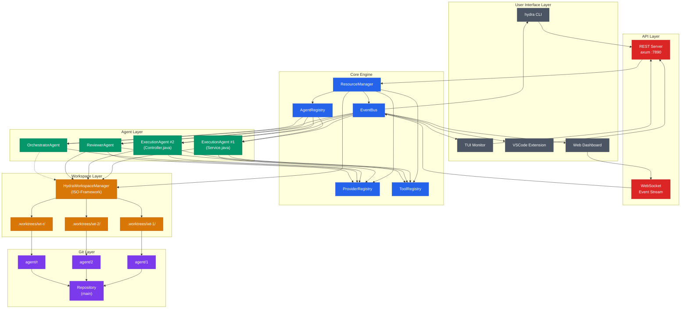
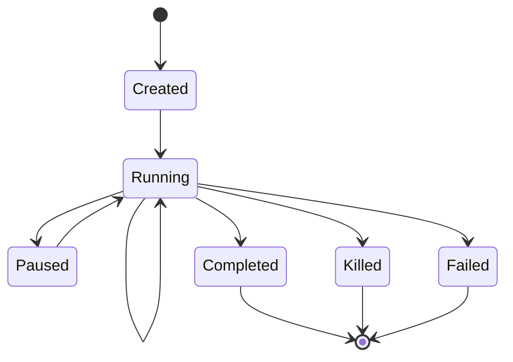
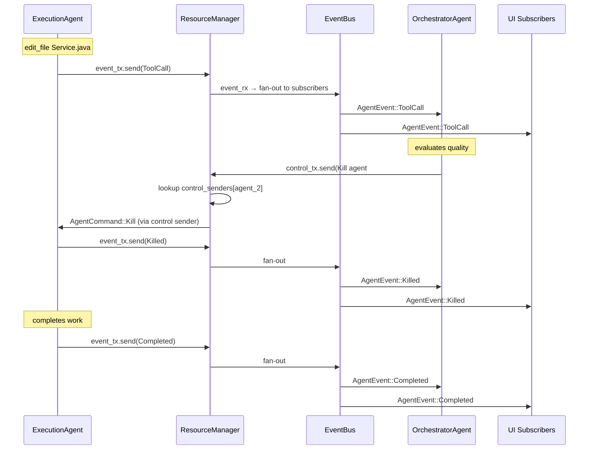
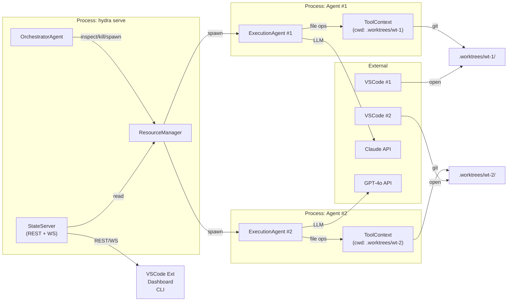
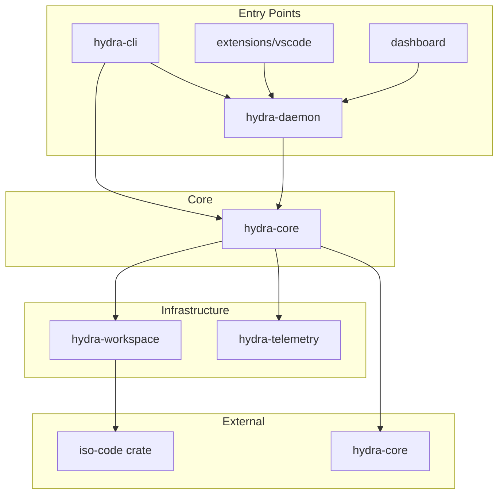
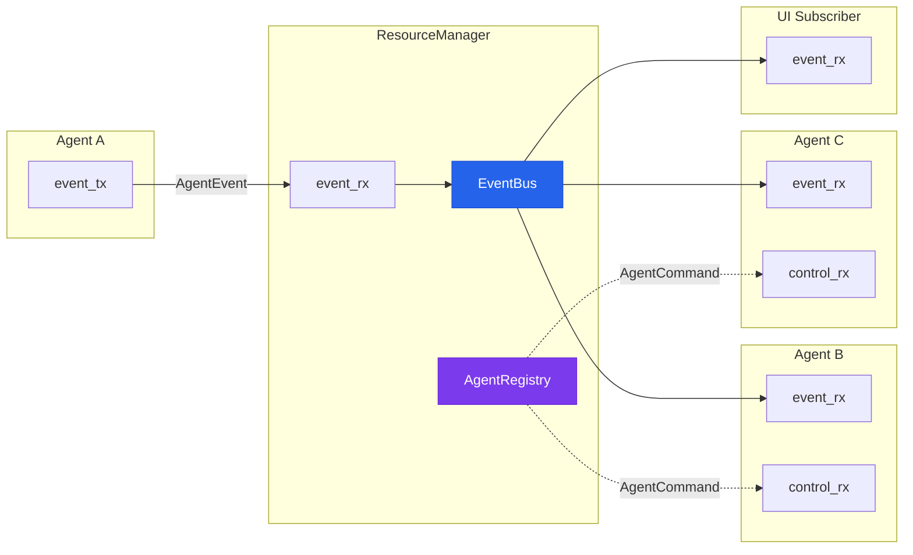
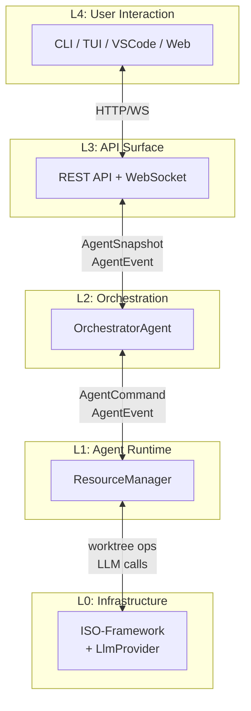

# Hydra Architecture Diagrams

All diagrams use Mermaid syntax. Render at https://mermaid.live or with VS Code Mermaid extension.

---

## 1. System Topology



---

## 2. Agent Lifecycle



**State transitions:**

| From | To | Trigger |
|------|----|---------|
| start | Created | `ResourceManager::spawn()` |
| Created | Running | `agent.run()` starts |
| Running | Running | LLM turn / tool execution |
| Running | Paused | `AgentCommand::Pause` |
| Paused | Running | `AgentCommand::Resume` |
| Running | Completed | natural finish |
| Running | Killed | `AgentCommand::Kill` |
| Running | Failed | unrecoverable error |
| Completed | end | cleanup (GC worktree) |
| Killed | end | cleanup (retain worktree if needed) |
| Failed | end | cleanup (retain worktree for debug) |

---

## 3. Event Flow



---

## 4. Deployment Topology



---

## 5. Crate Dependency Graph



---

## 6. Agent Communication Protocol



---

## 7. Workspace Isolation Model

### Directory Layout

```
repo-root/
├── .git/
├── src/
├── Cargo.toml
└── .worktrees/
    ├── wt-1/
    │   ├── .git                    (link to main .git)
    │   ├── src/
    │   ├── Cargo.toml
    │   └── .hydra-agent            (metadata: id, branch)
    ├── wt-2/
    └── wt-reviewer-1/
```

### Git Branch Structure

```
main ──────────────────────────────────────── (protected)
  │
  ├── agent/1 → .worktrees/wt-1/   ExecutionAgent #1
  │     └── "feat: add pagination"
  │
  ├── agent/2 → .worktrees/wt-2/   ExecutionAgent #2
  │     └── "feat: add Service call"
  │
  └── agent/r → .worktrees/wt-r/   ReviewerAgent #1
        └── (read-only, no commits)
```

### Merge Flow

```
agent/1 ──┐
           ├──→ staging/service-paginated ──→ main (merged)
agent/2 ──┘

Conflicts:
agent/1 ──→ staging/a ──┐
                        ├──→ main (manual resolution)
agent/2 ──→ staging/b ──┘
```

---

## 8. Layered Communication Model



---

## Diagram Conventions

| Color | Meaning |
|-------|---------|
| Blue | Core engine (ResourceManager, AgentRegistry, EventBus) |
| Green | Agents (Execution, Orchestrator, Reviewer) |
| Orange | Workspace (ISO-Framework, worktrees) |
| Purple | Git infrastructure (branches, repo) |
| Red | API layer (REST, WebSocket) |
| Gray | User-facing interfaces (CLI, TUI, VSCode) |

## How to Render

- **Mermaid Live Editor**: https://mermaid.live — paste any code block
- **VS Code**: Install "Mermaid Preview" extension, open this file
- **CLI**: `npm install -g @mermaid-js/mermaid-cli` then `mmdc -i diagrams.md -o architecture.svg`
- **GitHub**: Native support in markdown files
