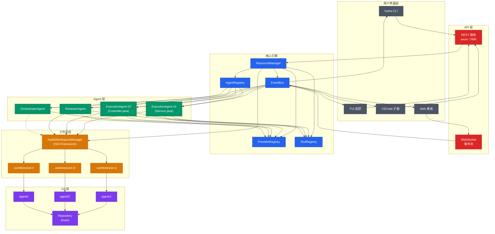
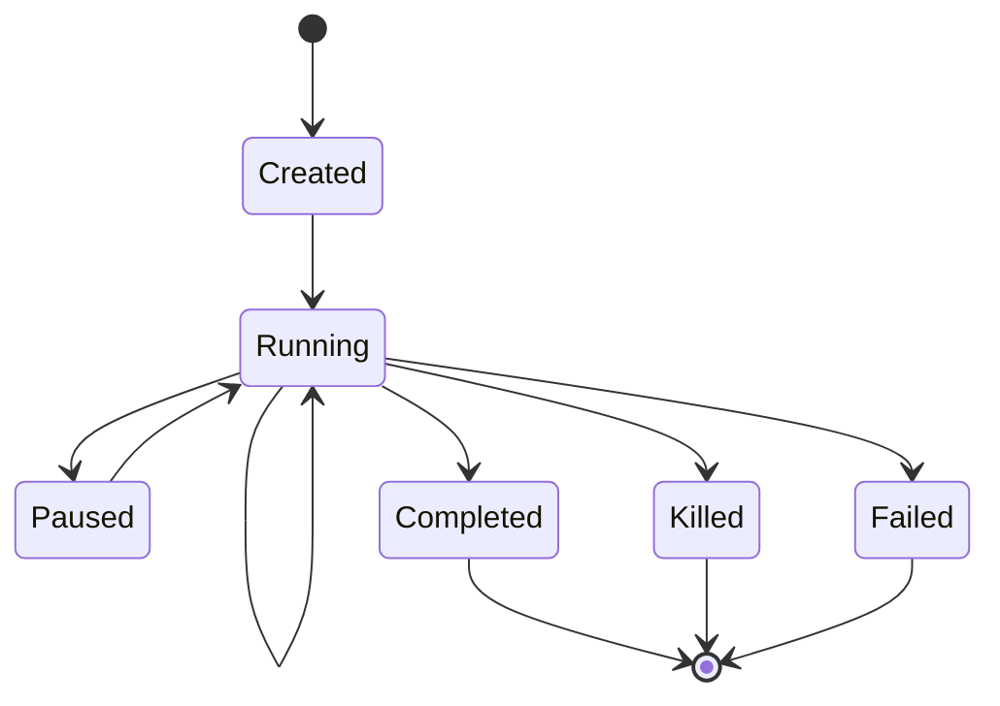
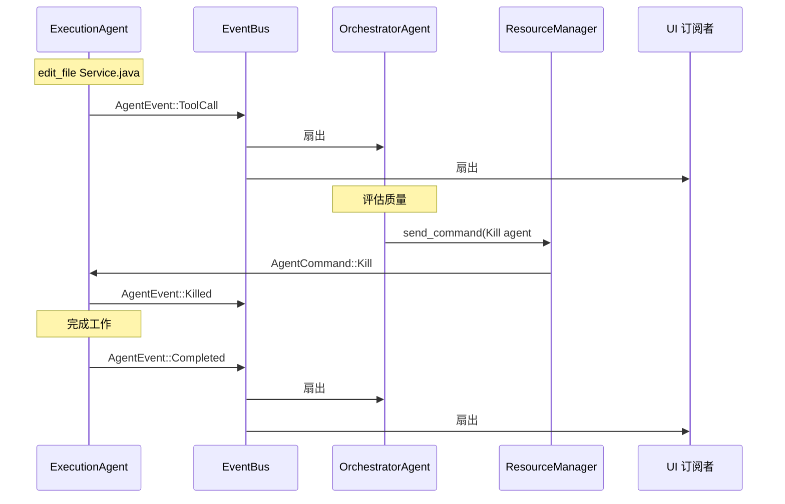
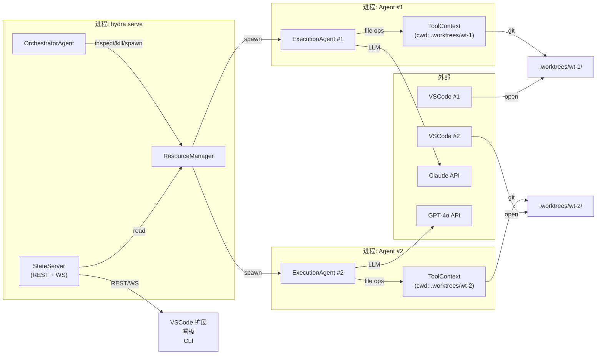
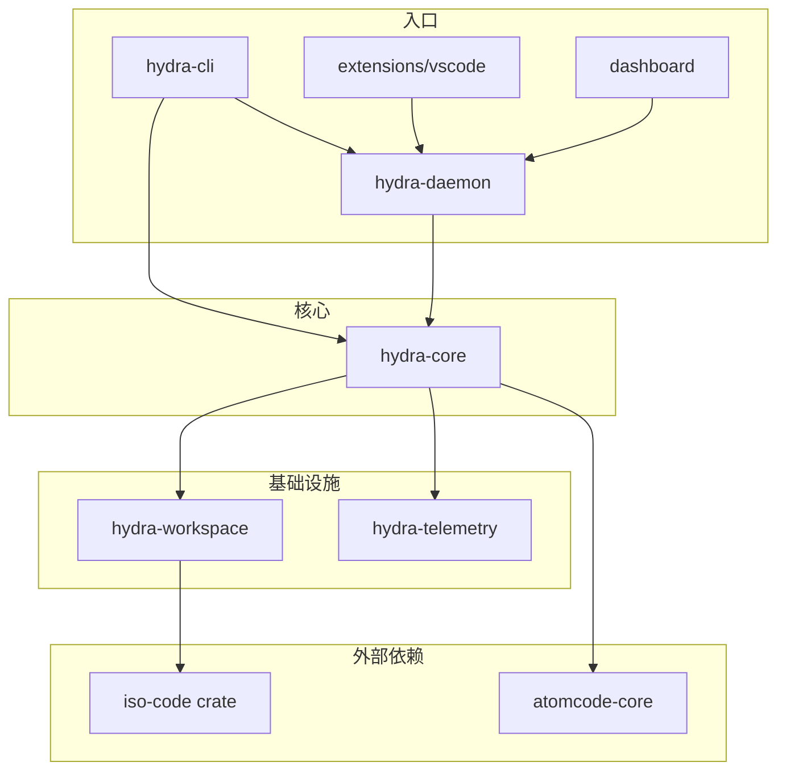
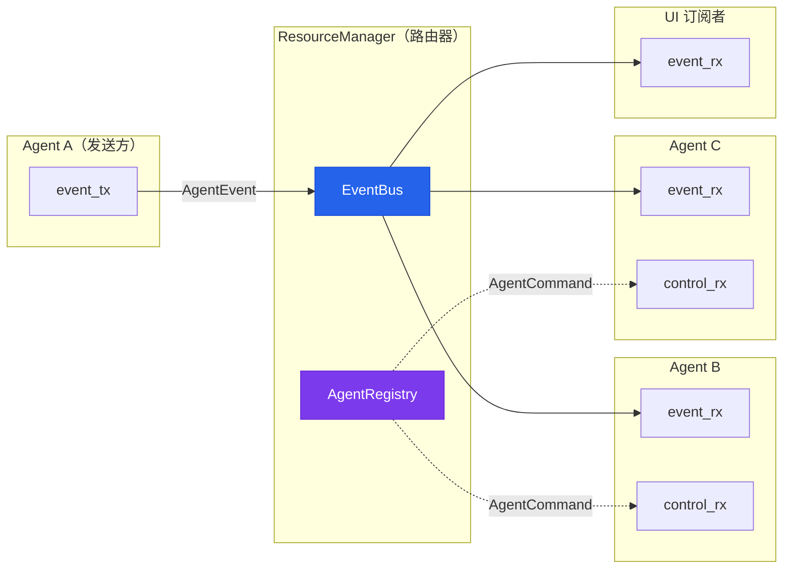
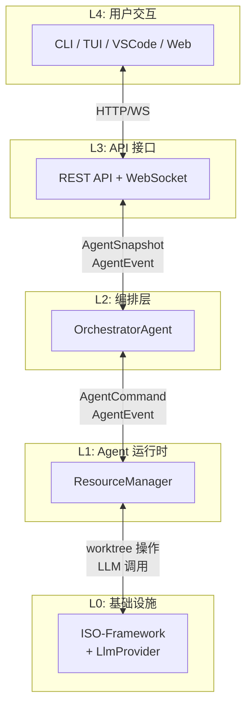

# Hydra 架构图

所有图表使用 Mermaid 语法。在 https://mermaid.live 或 VS Code Mermaid 插件中渲染。

---

## 1. 系统拓扑



---

## 2. Agent 生命周期



**状态转换说明：**

| 从 | 到 | 触发条件 |
|----|----|---------|
| 开始 | Created | `ResourceManager::spawn()` |
| Created | Running | `agent.run()` 启动 |
| Running | Running | LLM 轮次 / 工具执行 |
| Running | Paused | `AgentCommand::Pause` |
| Paused | Running | `AgentCommand::Resume` |
| Running | Completed | 自然完成 |
| Running | Killed | `AgentCommand::Kill` |
| Running | Failed | 不可恢复错误 |
| Completed | 结束 | cleanup（GC worktree） |
| Killed | 结束 | cleanup（根据需要保留 worktree） |
| Failed | 结束 | cleanup（保留 worktree 供调试） |

---

## 3. 事件流



---

## 4. 部署拓扑



---

## 5. Crate 依赖图



---

## 6. Agent 通信协议



---

## 7. 工作区隔离模型

### 目录布局

```
repo-root/
├── .git/
├── src/
├── Cargo.toml
└── .worktrees/
    ├── wt-1/
    │   ├── .git                    (链接到主 .git)
    │   ├── src/
    │   ├── Cargo.toml
    │   └── .hydra-agent            (元数据: id, branch)
    ├── wt-2/
    └── wt-reviewer-1/
```

### Git 分支结构

```
main ──────────────────────────────────────── (受保护)
  │
  ├── agent/1 → .worktrees/wt-1/   ExecutionAgent #1
  │     └── "feat: 添加分页"
  │
  ├── agent/2 → .worktrees/wt-2/   ExecutionAgent #2
  │     └── "feat: 添加 Service 调用"
  │
  └── agent/r → .worktrees/wt-r/   ReviewerAgent #1
        └── (只读，无提交)
```

### Merge 流程

```
agent/1 ──┐
           ├──→ staging/service-paginated ──→ main（已合并）
agent/2 ──┘

冲突情况:
agent/1 ──→ staging/a ──┐
                        ├──→ main（人工解决）
agent/2 ──→ staging/b ──┘
```

---

## 8. 分层通信模型



---

## 图表约定

| 颜色 | 含义 |
|-------|---------|
| 蓝色 | 核心引擎（ResourceManager、AgentRegistry、EventBus） |
| 绿色 | Agent（Execution、Orchestrator、Reviewer） |
| 橙色 | 工作区（ISO-Framework、worktree） |
| 紫色 | Git 基础设施（分支、仓库） |
| 红色 | API 层（REST、WebSocket） |
| 灰色 | 用户界面（CLI、TUI、VSCode） |

## 渲染方式

- **Mermaid Live Editor**: https://mermaid.live —— 粘贴任意代码块
- **VS Code**: 安装 "Mermaid Preview" 扩展，打开本文件
- **CLI**: `npm install -g @mermaid-js/mermaid-cli` 然后 `mmdc -i diagrams.zh.md -o architecture.svg`
- **GitHub**: markdown 文件原生支持
